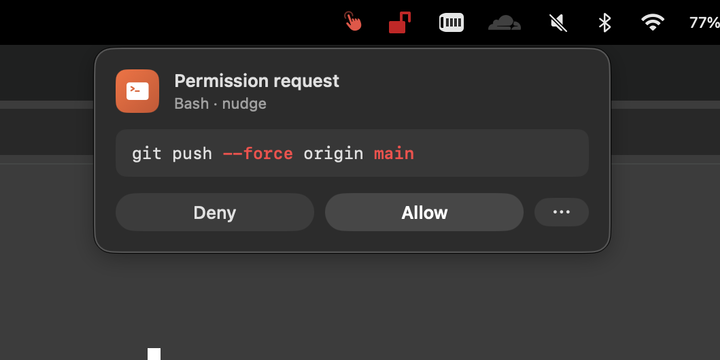
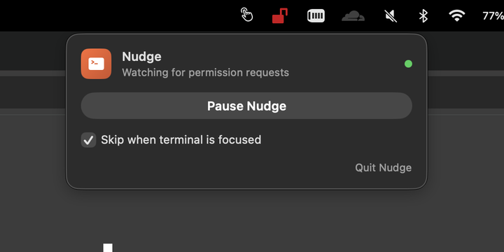
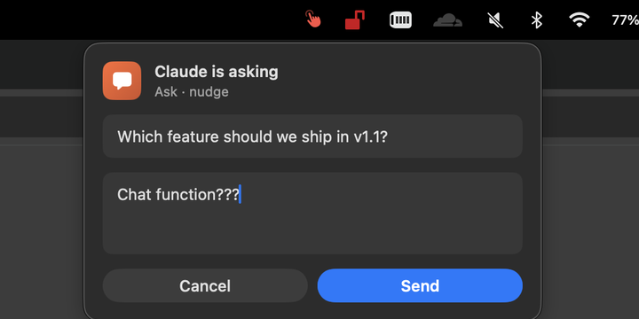

# Nudge

A macOS menu bar app for Claude Code permission prompts. When Claude wants to run something risky like `git push --force`, Nudge pops a small panel out of the menu bar instead of asking back in the terminal. Click Allow from wherever you are.



It also ships with `nudge-ask`, a small CLI Claude can call when it needs a free-form text answer from you. Same popover style, with a text field instead of Allow/Deny.

Experimental: `nudge-claude` can launch Claude Code inside a tmux session that Nudge can mirror from the menu bar. That gives you a compact transcript and reply box while you test the app Claude is building.

## Why I built it

I run Claude Code in auto mode and keep it on a side monitor. When something risky comes up, auto mode is supposed to stop and ask. But the prompt shows up in whichever terminal Claude is running in, and if I'm testing the app it just built, I don't see it for thirty seconds. Nudge surfaces those moments in the menu bar so I can answer without hunting.

It's opt-in, not a security blanket. You list patterns in `~/.config/nudge/patterns.txt`. Anything matching pops up; anything else goes through the normal Claude Code flow.

## Install

**One-line installer (builds from source):**

```sh
curl -fsSL https://raw.githubusercontent.com/ZachDeLong/nudge/main/install.sh | bash
```

**Manual source build:**

```sh
git clone https://github.com/ZachDeLong/nudge.git
cd nudge
make install
```

Either of those builds the app, copies it to `/Applications/Nudge.app`, seeds default patterns, wires a `PreToolUse` hook into `~/.claude/settings.json`, and launches Nudge in the background.

**Pre-built bundle (no build step):**

Grab `Nudge.app.zip` from the [latest release](https://github.com/ZachDeLong/nudge/releases/latest). Unzip and drop `Nudge.app` into `/Applications`. Since the build is unsigned, run this once after copying:

```sh
xattr -dr com.apple.quarantine /Applications/Nudge.app
```

Then clone the repo to wire the hook into Claude Code (you only need the scripts):

```sh
git clone https://github.com/ZachDeLong/nudge.git
cd nudge
./scripts/seed-patterns.sh  # creates ~/.config/nudge/patterns.txt with defaults
./scripts/install-hook.sh   # writes the PreToolUse entry into settings.json
open -ga Nudge
```

Requirements: macOS 14+ and `jq` (the hook installer reads and rewrites `~/.claude/settings.json`). Source builds also need Xcode Command Line Tools (no full Xcode required). Install jq with `brew install jq`.

## How it works

Two halves:

- **The app** runs as a menu bar icon. It owns an `NSStatusItem`, a popover, and a tiny localhost HTTP server. The server is how the hook talks to it.
- **The hook** is a small Swift CLI at `Nudge.app/Contents/MacOS/nudge-hook`. Claude Code runs it via the `PreToolUse` hook. It reads the tool call from stdin, checks `patterns.txt`, and POSTs to the app with a local bearer token if there's a match. Then it blocks until you click Allow or Deny.

If the app isn't running when the hook fires, the hook auto-launches it via `open -ga Nudge`. If anything fails, the hook exits silently and Claude falls back to its normal terminal prompt.

On first launch, Nudge creates `~/.config/nudge/token` with a random local bearer token. The server requires that token for `/prompt` and `/ask`, which keeps unrelated local processes from casually posting fake prompts if they discover the port.

## Patterns

`~/.config/nudge/patterns.txt` controls everything. One Claude Code permission rule per line. The hook re-reads it on every call, so edits take effect immediately.

```
# Bash
Bash(git push:*)        # command starts with `git push`
Bash(rm:*)              # command starts with `rm`
Bash(*--force*)         # command contains --force anywhere
Bash(git rebase)        # exact match

# File-based tools (Edit, Write, Read, MultiEdit, NotebookEdit)
Edit(/etc/**)               # any file under /etc
Write(**/.env*)             # any .env-something file, anywhere
Edit(/Users/**/.claude/**)  # any user's claude config
```

`*` matches a single path segment; `**` matches across slashes. Bash supports prefix (`x:*`), infix (`*x*`), and exact match.

Chained Bash calls match too. The hook tokenizes the command on `&&`, `||`, `;`, `|`, and `&` (respecting quotes, `$(...)` substitutions, and `$((...))` arithmetic), then checks each segment. Subshell `(...)` and brace `{...;}` wrappers are peeled and re-checked. So `Bash(git push:*)` fires on `cd ~/repo && git push`, and `Bash(rm:*)` fires on `(rm -rf foo); ls` — the way agents (and humans) actually run things.

Prefix patterns match at token boundaries: `Bash(rm:*)` catches `rm` and `rm -rf foo` but not `rmdir`. Infix patterns ignore case, quote characters, and backslash escapes, and inline the bodies of `$(...)` / backticks: `Bash(*--force*)` catches `--FORCE`, `--for""ce`, `git push --for\ce`, and `git push $(echo --force)`. Determined adversarial inputs (env-var split-and-reassemble, `printf '\xNN'` hex escapes, `eval`, `base64 -d`) aren't normalized — Nudge's threat model is agent-accident, not adversarial bypass.

When you install, Nudge also imports `Bash()`-style rules from your existing `permissions.ask` array in `~/.claude/settings.json`. So if you've already told Claude Code to ask about `git push:*`, Nudge picks that up automatically. Run `make import-permissions` later to merge in new ones.

## "Always allow"

Each popover has a `⋯` button next to Allow with two options:

- **Allow for this session.** Adds the exact command to an in-memory list, won't ask again until you restart Nudge.
- **Always allow this command.** Promotes the matched pattern (e.g. `Bash(git push:*)`) into your `permissions.allow`. Claude auto-allows the whole class going forward; Nudge stops prompting.

### Why infix patterns can't be promoted

Promoting a pattern adds it to `permissions.allow`, so Claude auto-approves the whole class going forward. That's the right move for prefix patterns like `Bash(git push:*)` — you explicitly opted into "anything starting with `git push`."

Infix patterns are deny-leaning. You wrote `Bash(*--force*)` because you want to be asked any time `--force` appears. Promoting it would mean "auto-allow any command containing `--force`" — the opposite of the intent. So:

- The "Always allow" menu is hidden on infix matches; only Allow / Deny show.
- When a command matches both an infix and a prefix pattern, the infix wins. If you later promote `Bash(git push:*)` from a regular `git push origin main`, the next `git push --force` will still trigger a prompt, because the infix match takes priority.

The hook's matcher returns infix hits before promotable prefix/exact hits for exactly this reason.

## Settings

Click the menu bar icon when there's no prompt up. The idle popover doubles as a settings panel:




- **Pause Nudge / Resume Nudge.** Master switch. Paused = the hook exits silently and Claude falls back to its native terminal prompt. The status pill and icon both reflect the current state.
- **Skip when terminal is focused** (on by default). When the frontmost app is a known terminal or IDE (Ghostty, iTerm2, Terminal.app, Warp, wezterm, Hyper, VS Code, Cursor), the hook skips the popover. You're already there; Claude's native prompt is fine.
- **Quit Nudge.** Exits the menu bar app entirely. The hook auto-launches it again on the next call.

Right-clicking the icon opens the same toggles as a context menu, in case that's the gesture you reach for.

Settings persist in `~/.config/nudge/prefs.json` and are re-read on every hook call, so toggles take effect immediately. The local HTTP token lives next to it at `~/.config/nudge/token`; you normally should not need to edit it.

## nudge-ask

A CLI Claude can call when it needs a free-form text answer.




```sh
/Applications/Nudge.app/Contents/MacOS/nudge-ask "Which deployment target?"
# popover with a text field appears
# user types "staging", clicks Send
# "staging" lands on stdout
```

Exit code 0 with the answer on stdout. Exit code 130 if the user cancels. Anything else if Nudge is unreachable.

To opt Claude into using it, drop the skill into your skills directory:

```sh
cp -R skills/nudge-ask ~/.claude/skills/
```

Or paste this into your Claude Code session and Claude will wire it up itself:

> Add `Bash(/Applications/Nudge.app/Contents/MacOS/nudge-ask:*)` to my `~/.claude/settings.json` permissions.allow array. Then append this to `~/.claude/CLAUDE.md`: "When you need a free-form text answer from me, run `/Applications/Nudge.app/Contents/MacOS/nudge-ask "<question>"` via Bash and use stdout as my reply."

Either way, pre-allowing the `Bash(...:*)` rule keeps Claude from prompting before each call.

## Agent sessions

`nudge-claude` starts Claude Code inside a named tmux session and attaches your terminal to it:

```sh
/Applications/Nudge.app/Contents/MacOS/nudge-claude
```

Once it is running, click the Nudge menu bar icon with no permission prompt active. The idle panel shows mirrored agent sessions, recent terminal output, and a reply box. Messages sent there are forwarded to the same tmux pane via `tmux send-keys`, so the terminal Claude session keeps its cwd, project context, skills, plugins, MCPs, and hooks.

Requirements for this experimental mode: `tmux` and the `claude` CLI on your `PATH`. Install tmux with `brew install tmux`. Nudge checks the usual Homebrew tmux paths when the menu bar app is launched without your shell `PATH`; set `NUDGE_TMUX_PATH` if tmux lives somewhere custom.

## Known limits

- **Unsigned build.** The Makefile runs `xattr -d com.apple.quarantine` so it launches without Gatekeeper complaining, but the build isn't code-signed or notarized. If you download the prebuilt zip, you'll need to run that `xattr` command yourself once.
- **One Mac at a time.** Patterns aren't synced across machines.
- **Hooks fire before Claude classifies.** That's why patterns are explicit opt-in rather than "everything auto mode would prompt about." `PreToolUse` runs before Claude decides whether a call would trigger a prompt, and the `PermissionRequest` event (which fires at the right time) is observe-only.
- **Queue is FIFO with a 5-minute timeout.** Pile up enough prompts and the older ones expire.
- **Agent session mirroring requires `nudge-claude`.** Nudge can cleanly mirror sessions it launched through tmux; it does not attach to arbitrary existing terminal tabs.

## Uninstall

```sh
cd /path/to/nudge && make uninstall
```

Removes `/Applications/Nudge.app`, kills the running app, removes runtime port/token files, and cleans the hook out of `settings.json` (with a backup). Your patterns and prefs are left in `~/.config/nudge/`.

## License

MIT. See [LICENSE](./LICENSE).
