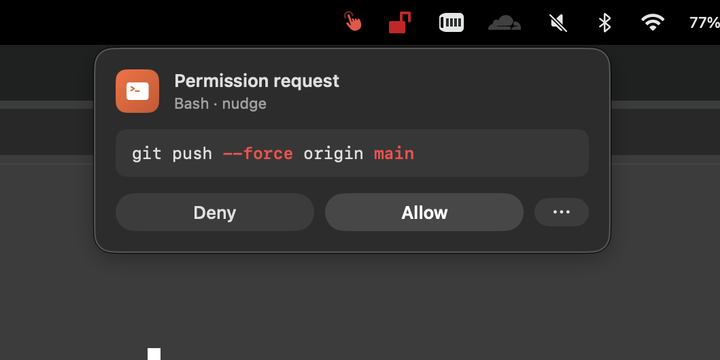
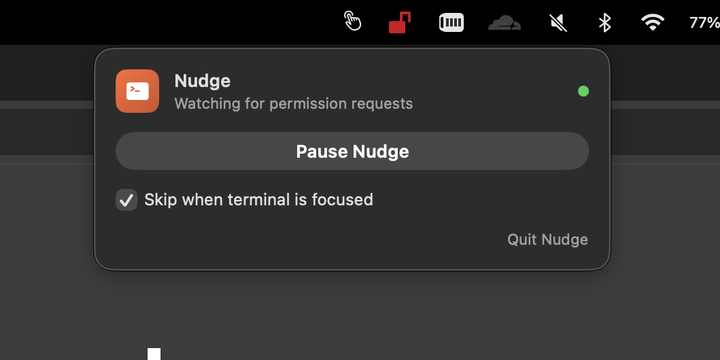
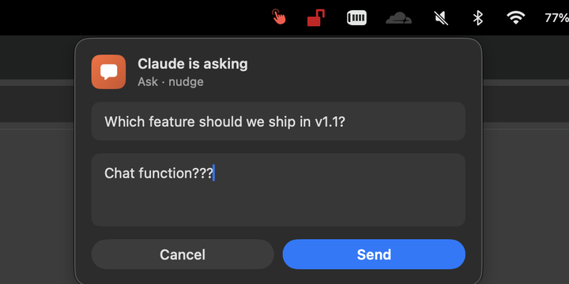
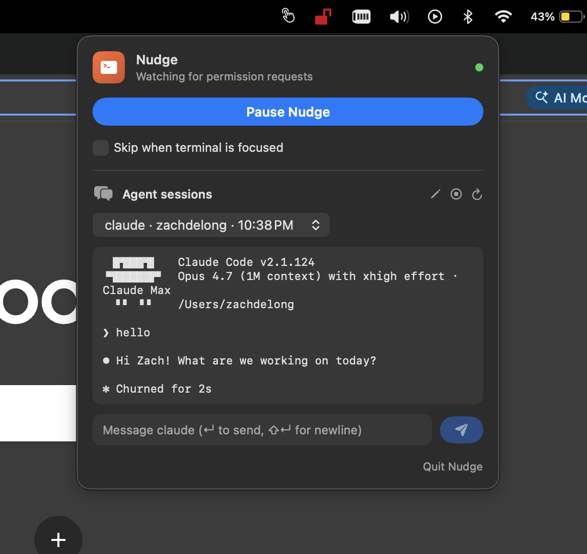

# Nudge

A macOS menu bar app for Claude Code permission prompts. When Claude pauses to ask before running something (say a `git push --force`, or an edit to a config file), Nudge pops a small panel out of the menu bar instead of asking back in the terminal. Click Allow from wherever you are.



It also ships with `nudge-ask`, a small CLI Claude can call when it needs a free-form text answer from you. Same popover style, with a text field instead of Allow/Deny.

Experimental: `nudge-claude` can launch Claude Code inside a tmux session that Nudge can mirror from the menu bar. That gives you a compact transcript and reply box while you test the app Claude is building.

## Why I built it

Half the time im developing I run Claude Code on just my Mac screen. When Claude pauses to ask permission, the prompt shows up in whichever terminal Claude is running in. If I'm testing the app it just built, I don't see it for thirty seconds. Nudge surfaces those moments in the menu bar so I can answer without hunting.

It's a quality-of-life thing, not a security tool. When you're on one screen, you just don't want to keep tabbing back to the terminal to click Allow. Works in any Claude Code permission mode — default, accept-edits, plan, auto — whenever a tool call matches a pattern in `~/.config/nudge/patterns.txt`. Anything matching pops up; anything else goes through the normal Claude Code flow.

## Install

**One-line installer (builds from source):**

```sh
curl -fsSL https://raw.githubusercontent.com/ZachDeLong/nudge/main/install.sh | bash
```

**Manual source build:**

```sh
git clone https://github.com/ZachDeLong/nudge.git
cd nudge
make install
```

Either of those builds the app, copies it to `/Applications/Nudge.app`, seeds default patterns, wires Claude Code hooks into `~/.claude/settings.json`, and launches Nudge in the background.

**Pre-built bundle (no build step):**

Grab `Nudge.app.zip` from the [latest release](https://github.com/ZachDeLong/nudge/releases/latest). Unzip and drop `Nudge.app` into `/Applications`. Since the build is unsigned, run this once after copying:

```sh
xattr -dr com.apple.quarantine /Applications/Nudge.app
```

Then clone the repo to wire the hook into Claude Code (you only need the scripts):

```sh
git clone https://github.com/ZachDeLong/nudge.git
cd nudge
./scripts/seed-patterns.sh  # creates ~/.config/nudge/patterns.txt with defaults
./scripts/install-hook.sh   # writes Nudge hook entries into settings.json
open -ga Nudge
```

Requirements: macOS 14+ and `jq` (the hook installer reads and rewrites `~/.claude/settings.json`). Source builds also need Xcode Command Line Tools (no full Xcode required). Install jq with `brew install jq`. The chat-mirror feature also needs `tmux` (`brew install tmux`).

`make install` also symlinks `nudge-claude` and `nudge-update` into a writable directory in your PATH (it tries `/opt/homebrew/bin`, `/usr/local/bin`, `~/.local/bin`, then `~/bin`), so you can just run them from anywhere.

## Updates

`nudge-update` checks GitHub releases for a newer build:

```sh
nudge-update           # print current vs latest, exit 0
nudge-update --check   # exit 1 if an update is available (handy in scripts)
nudge-update --apply   # verify checksum, download Nudge.app.zip, swap, relaunch
```

`--apply` checks the download against the `Nudge.app.zip.sha256` published with each release, and refuses to touch `/Applications/Nudge.app` if it doesn't match or if the release has no checksum attached. Releases before v1.2.2 predate the checksum, so updating from one needs `--apply --no-verify`. Since the build is unsigned there's no Gatekeeper check behind this — it's a tripwire for a truncated or tampered download, not a substitute for notarization.

Releases are produced by `.github/workflows/release.yml` on `v*` tag pushes. The workflow refuses to publish unless `Resources-Info.plist`'s `CFBundleShortVersionString` matches the tag, so bump the plist before tagging.

Sparkle is on the roadmap once the project earns code signing.

## How it works

Two halves:

- **The app** runs as a menu bar icon. It owns an `NSStatusItem`, a popover, and a tiny localhost HTTP server. The server is how the hook talks to it.
- **The permission hook** is a small Swift CLI at `Nudge.app/Contents/MacOS/nudge-hook`. Claude Code runs it via `PreToolUse`. It reads the tool call from stdin, checks `patterns.txt`, and POSTs to the app with a local bearer token if there's a match. Then it blocks until you click Allow or Deny.
- **The agent hook** is a non-blocking Swift CLI at `Nudge.app/Contents/MacOS/nudge-agent-hook`. Claude Code runs it for lifecycle/tool events like `UserPromptSubmit`, `PreToolUse`, `PostToolUse`, `PostToolUseFailure`, `Notification`, and `Stop`, so Nudge can show whether a mirrored session is thinking, using a tool, waiting, idle, failed, or ended.

If the app isn't running when the hook fires, the hook auto-launches it via `open -ga Nudge` — unless you quit it deliberately, in which case it stays quit until you start it yourself. If anything fails, the hook exits silently and Claude falls back to its normal terminal prompt.

On first launch, Nudge creates `~/.config/nudge/token` with a random local bearer token. The server requires that token for `/prompt` and `/ask`, which keeps unrelated local processes from casually posting fake prompts if they discover the port.

## Patterns

`~/.config/nudge/patterns.txt` is the opt-in list. One rule per line; the hook re-reads it on every call, so edits take effect immediately.

```
Bash(git push:*)        # prefix
Bash(*--force*)         # infix (deny-leaning, won't promote)
Edit(/etc/**)           # path glob
Mcp(playwright__*)      # MCP server-wide
```

Full syntax, the chained-command and quote-normalization rules, "Always allow" promotion, and the import-from-`permissions.ask` flow are in [docs/patterns.md](docs/patterns.md).

## Settings

Click the menu bar icon when there's no prompt up. The idle popover doubles as a settings panel:




- **Pause Nudge / Resume Nudge.** Master switch. Paused = both hooks exit silently and Claude falls back to its native terminal prompt. That covers the agent hook too, so a paused Nudge stops collecting activity as well as popping panels. The status pill and icon both reflect the current state.
- **Skip when terminal is focused** (on by default). When the frontmost app is a known terminal or IDE (Ghostty, iTerm2, Terminal.app, Warp, wezterm, Hyper, VS Code, Cursor), the hook skips the popover. You're already there; Claude's native prompt is fine.
- **Answer with ⏎ and esc from any app.** While a prompt is up, Enter allows and Esc denies, even if you're in another app. macOS won't pass those keys to Nudge until you turn it on in System Settings → Privacy & Security → Accessibility. Until you do, the settings panel shows an Enable… button and the popover leaves off the key hints. Nudge ignores the keys for the first 0.6 seconds a prompt is on screen, and it ignores them if you're holding a modifier or the key is repeating. So pressing Enter in a browser form just as a prompt pops up won't approve it. One annoyance: the build is unsigned, so macOS forgets the grant every time you rebuild or update. Remove Nudge from the list and turn it back on.
- **Quit Nudge.** Exits the menu bar app entirely and stays exited — the hooks won't relaunch it behind your back. Start it again from Spotlight or `/Applications` and auto-launch resumes. (A crash is different: that still auto-recovers on the next hook call.)

Right-clicking the icon opens the same toggles as a context menu, in case that's the gesture you reach for.

Settings persist in `~/.config/nudge/prefs.json` and are re-read on every hook call, so toggles take effect immediately. The local HTTP token lives next to it at `~/.config/nudge/token`; you normally should not need to edit it.

## nudge-ask

A CLI Claude can call when it needs a free-form text answer.




```sh
/Applications/Nudge.app/Contents/MacOS/nudge-ask "Which deployment target?"
# popover with a text field appears
# user types "staging", clicks Send
# "staging" lands on stdout
```

Exit code 0 with the answer on stdout. Exit code 130 if the user cancels. Anything else if Nudge is unreachable.

To opt Claude into using it, drop the skill into your skills directory:

```sh
cp -R skills/nudge-ask ~/.claude/skills/
```

Or paste this into your Claude Code session and Claude will wire it up itself:

> Add `Bash(/Applications/Nudge.app/Contents/MacOS/nudge-ask:*)` to my `~/.claude/settings.json` permissions.allow array. Then append this to `~/.claude/CLAUDE.md`: "When you need a free-form text answer from me, run `/Applications/Nudge.app/Contents/MacOS/nudge-ask "<question>"` via Bash and use stdout as my reply."

Either way, pre-allowing the `Bash(...:*)` rule keeps Claude from prompting before each call.

## Agent sessions

`nudge-claude` starts Claude Code inside a named tmux session and attaches your terminal to it. The session keeps running if you close the terminal, so you can re-attach later or chat from the Nudge popover.

```sh
nudge-claude              # start a new session in the current directory
nudge-claude attach       # re-attach to the most recent session
nudge-claude attach <id>  # attach to a specific session (id from `list`)
nudge-claude list         # list mirrored sessions
nudge-claude prune [days] # remove stale missing/ended records older than days (default: 7)
nudge-claude --help       # show help
```

(If `nudge-claude` isn't on your PATH, run `/Applications/Nudge.app/Contents/MacOS/nudge-claude` or re-run `make install` to create the symlink.)

Detach from a session without stopping it: `Ctrl-b` then `d` (the standard tmux detach binding). Claude keeps thinking; you can re-attach or chat via the menu bar.

### Mirroring in the menu bar

Click the Nudge menu bar icon with no permission prompt active. The idle panel shows a session picker, current agent state, the recent transcript, and a reply box.




- **Picker** switches between active sessions. Labels show `kind · project · time` or whatever you've named them.
- **Pencil (✏️)** renames a session. The name is saved to `~/.config/nudge/sessions/<id>.json`.
- **Stop (⏹)** kills the tmux pane and removes the session record.
- **Refresh (↻)** pulls the latest transcript. The panel also polls every 1.5s while open.
- **Send** with Enter. Shift+Enter inserts a newline.
- **Status** comes from Claude Code hooks when available, so Nudge can show tool use and idle/waiting state without guessing from terminal text.

Messages are forwarded to the tmux pane via a bracketed paste buffer, so multiline prompts survive and the terminal Claude session keeps its cwd, project context, skills, plugins, MCPs, and hooks.

### Requirements & threat model

Needs `tmux` and the `claude` CLI on your `PATH`. Install tmux with `brew install tmux`. Nudge checks the usual Homebrew tmux paths when the menu bar app is launched without your shell `PATH`; set `NUDGE_TMUX_PATH` if tmux lives somewhere custom.

Session metadata at `~/.config/nudge/sessions/*.json` is owner-only (`0o600`) and validated on read. Nudge refuses to load a planted JSON from another local user. Messages sent through the chat input have control bytes and Unicode line separators stripped before reaching tmux, so a chat message can't deliver terminal escape sequences to the pane.

## Known limits

- **Unsigned build.** The Makefile runs `xattr -d com.apple.quarantine` so it launches without Gatekeeper complaining, but the build isn't code-signed or notarized. If you download the prebuilt zip, you'll need to run that `xattr` command yourself once.
- **One Mac at a time.** Patterns aren't synced across machines.
- **Hooks fire before Claude classifies.** That's why patterns are explicit opt-in rather than "everything auto mode would prompt about." `PreToolUse` runs before Claude decides whether a call would trigger a prompt, and the `PermissionRequest` event (which fires at the right time) is observe-only.
- **Queue is FIFO with a 5-minute timeout.** Pile up enough prompts and the older ones expire. If Claude stops waiting on a prompt (say you hit Esc in the terminal), it drops out of the queue right away. The panel tells you and moves on to the next one.
- **Agent session mirroring requires `nudge-claude`.** Nudge can cleanly mirror sessions it launched through tmux; it does not attach to arbitrary existing terminal tabs.

## Uninstall

```sh
cd /path/to/nudge && make uninstall
```

Removes `/Applications/Nudge.app`, kills the running app, removes runtime port/token files, and cleans the hook out of `settings.json` (with a backup). Your patterns and prefs are left in `~/.config/nudge/`.

## License

MIT. See [LICENSE](./LICENSE).
