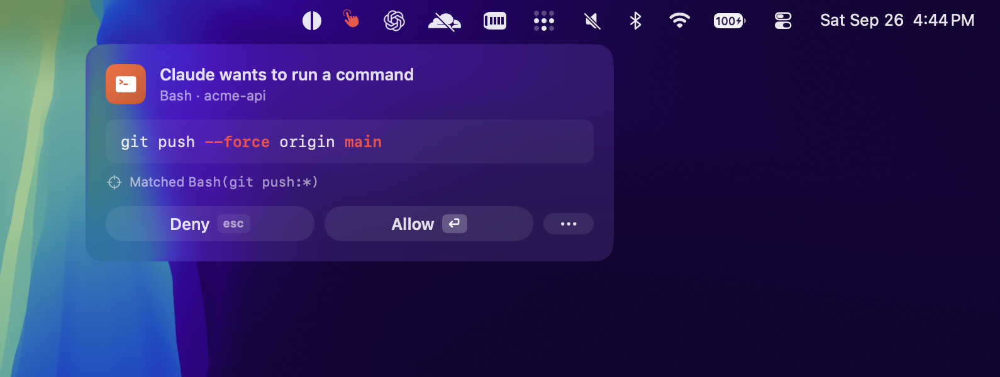
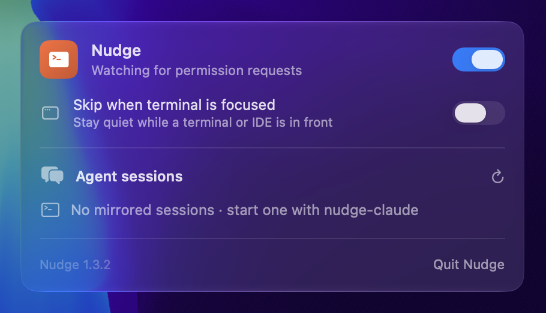
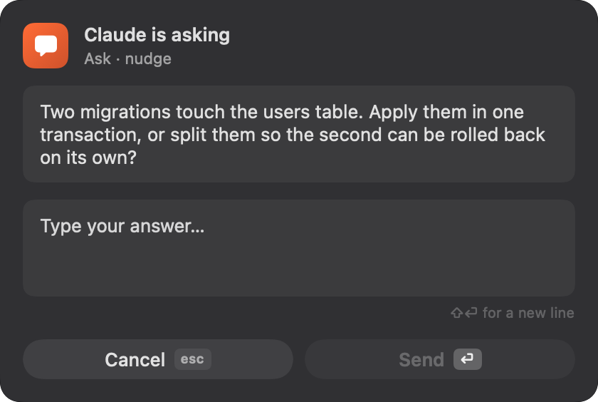
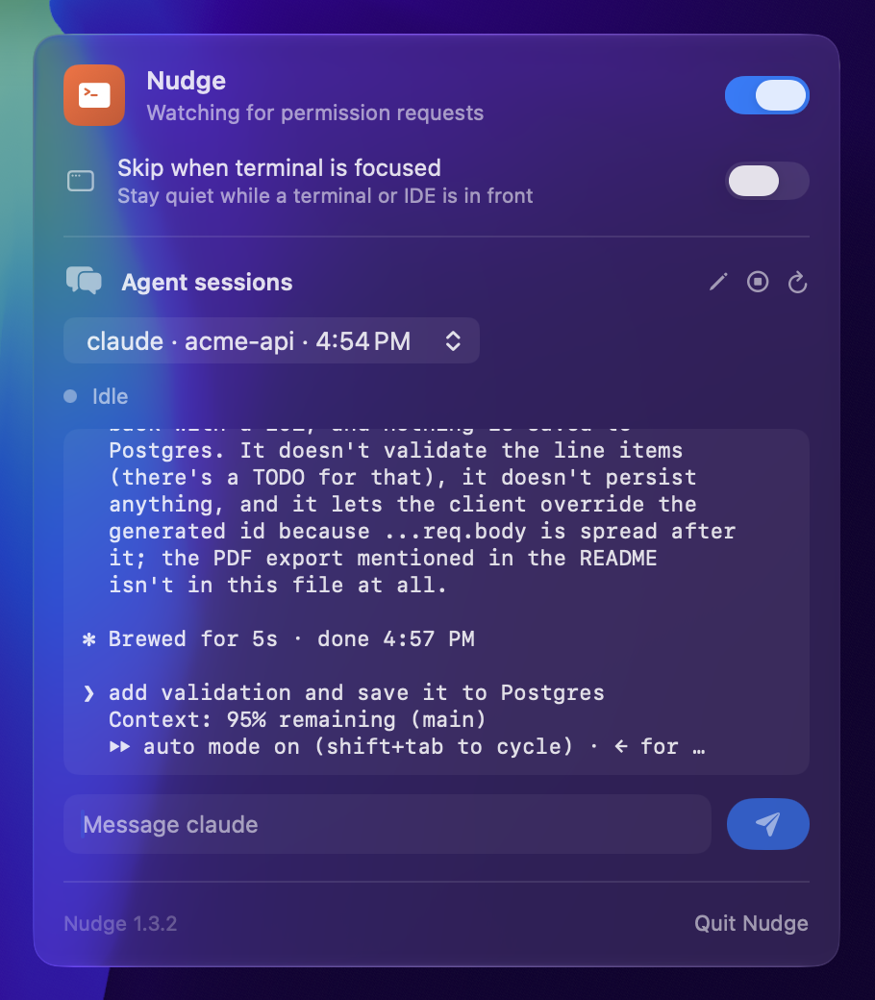

# Nudge

Claude Code and Codex permission prompts, in your menu bar.

When Claude stops to ask before running something (a `git push --force`, an edit to a config file), Nudge pops a panel out of the menu bar so you can click Allow from whatever app you're in. You don't have to go find the terminal.

Nudge asks exactly when Claude Code would ask. If an allow rule or auto mode already covers a call, you don't see it. Plan approvals and Claude's multiple-choice questions stay in the terminal.

It's a quality-of-life tool, not a security tool. The terminal still works: answer there and Nudge's copy goes away.



## What's in the box

- **Permission popover.** Allow, Deny, allow for this session, or always allow. Enter and Esc work from any app once you grant Accessibility access (or switch them off).
- **`nudge-ask`.** A CLI Claude can call when it needs a typed answer from you. Same popover, with a text field.
- **Agent sessions** (experimental). `nudge-claude` runs Claude Code in tmux, and the menu bar shows the live transcript with a reply box.
- **`nudge-update`.** Checks GitHub for a new release and installs it after verifying the checksum.

## Install

With [Homebrew](https://brew.sh):

```sh
brew install --cask zachdelong/tap/nudge
nudge-setup
```

`nudge-setup` seeds default patterns, adds the hooks to `~/.claude/settings.json` (and to `~/.codex/hooks.json` if you use [Codex](#codex)), and starts Nudge. It's safe to run again. `nudge-setup --remove` takes the hooks back out.

You'll need macOS 14+. Agent sessions also need `tmux`.

<details>
<summary>From source, or without Homebrew</summary>

Build from source with the install script, or clone and `make install`. You'll need Xcode Command Line Tools and `jq`.

```sh
curl -fsSL https://raw.githubusercontent.com/ZachDeLong/nudge/main/install.sh | bash
```

Or grab `Nudge.app.zip` from the [latest release](https://github.com/ZachDeLong/nudge/releases/latest), unzip it into `/Applications`, clear the quarantine flag, and run the setup script bundled in the app:

```sh
xattr -dr com.apple.quarantine /Applications/Nudge.app
/Applications/Nudge.app/Contents/Resources/setup/nudge-setup.sh
```

Releases are signed with a self-signed certificate, not an Apple one. Gatekeeper doesn't recognize it, which is why a fresh download needs the `xattr` step (Homebrew does it for you). It also means macOS keeps Nudge's Accessibility permission across updates.

</details>

## Codex

Nudge answers Codex's approval requests too, from the CLI or the ChatGPT app. If you have `~/.codex`, `nudge-setup` (or `make install`) adds two entries to its `hooks.json`, after backing the file up:

- `PermissionRequest` runs `nudge-hook --agent codex` when Codex is about to ask. The popover says Codex and shows the command, or the patch and the files it touches.
- `Interrupt` runs `nudge-agent-hook --agent codex`. Stop a turn in Codex and Nudge's copy of its prompt goes away.

Codex skips new hooks until you trust them. Do it once: run `codex` in a terminal (the ChatGPT app ships it at `/Applications/ChatGPT.app/Contents/Resources/codex`), type `/hooks`, and trust Nudge's two entries.

A few things work differently from Claude Code:

- Codex doesn't show its own prompt while Nudge is asking. If you don't answer in 2 minutes, Nudge hands the request back and Codex asks as usual. Pausing Nudge does that right away.
- If you use auto-review, Nudge asks you before the reviewer sees anything. Codex doesn't tell hooks which reviewer it would use.
- With "Skip when terminal is focused" on, Nudge also stays quiet while the ChatGPT app is in front.
- Patterns and "Always allow" are Claude-only.

## Patterns

Patterns are for things you want to be asked about even when Claude wouldn't ask, like a command you've allow-listed or anything in auto mode. They live in `~/.config/nudge/patterns.txt`, one rule per line, and edits apply immediately. An empty file is fine: Nudge still shows Claude's own prompts.

```
Bash(git push:*)        # prefix
Bash(*--force*)         # infix
Edit(/etc/**)           # path glob
Mcp(playwright__*)      # every tool on an MCP server
```

"Always allow" from the popover writes a matching rule into Claude Code's allow list, after backing up `settings.json`. The full syntax, chained-command handling, and importing from `permissions.ask` are in [docs/patterns.md](docs/patterns.md).

## Settings

Click the menu bar icon when there's no prompt up, or right-click it to get the same toggles as a menu.



A few things the panel doesn't tell you:

- **⏎ / esc from any app** needs Accessibility access: System Settings → Privacy & Security → Accessibility, which macOS 27 renamed Device Control and Data Access. The Enable… button in the panel opens it. Since 1.4.2 macOS keeps that grant across updates. Coming from an older version, remove Nudge from the list and add it back once. Keys are ignored for the first 0.6s a prompt is up, and until you've stopped typing elsewhere for a second, so the Enter at the end of a paragraph doesn't approve anything. They also do nothing while a terminal, an IDE or the ChatGPT app is in front, where they belong to the agent's own dialog. If you'd rather only click, switch off "Answer with ⏎ and esc".
- **Quit means quit.** The hooks won't relaunch Nudge until you open it yourself. If it crashes, it comes back on the next hook call.

## nudge-ask



```sh
/Applications/Nudge.app/Contents/MacOS/nudge-ask "Which deployment target?"
# → prints what you typed; exit 130 if you cancel
```

To let Claude use it, copy the skill over and pre-allow the command so Claude doesn't ask permission to ask you a question:

```sh
cp -R skills/nudge-ask ~/.claude/skills/
```

and add `Bash(/Applications/Nudge.app/Contents/MacOS/nudge-ask:*)` to `permissions.allow` in `~/.claude/settings.json`.

## Agent sessions (experimental)

```sh
nudge-claude              # start Claude Code in a tmux session here
nudge-claude attach [id]  # re-attach (latest, or a specific one)
nudge-claude list         # list sessions
nudge-claude prune [days] # clean up ended sessions (default 7 days)
```

Detach with `Ctrl-b d`. Claude keeps working, and the menu bar panel lets you pick a session, see what it's doing (thinking, using a tool, waiting, idle), read the transcript, and send replies. Replies are pasted into the tmux pane, so Claude keeps its cwd, skills, MCPs, and hooks.



Nudge only mirrors sessions it started. It can't attach to a terminal tab that's already open. Set `NUDGE_TMUX_PATH` if tmux isn't somewhere Homebrew would put it. If your Claude setup reads files from `~/Documents` (a `CLAUDE.md` import, say), macOS asks once whether `nudge-claude` may access that folder; allow it, or sessions start without those files.

## Updating

```sh
nudge-update           # current vs latest
nudge-update --check   # exit 1 if an update is available
nudge-update --apply   # download, verify sha256, swap, relaunch
```

`--apply` won't install a download that doesn't match the release's published checksum.

Updating from 1.3.x or earlier: the first time the new Nudge starts, it adds its `PermissionRequest` hook to `~/.claude/settings.json`, after backing the file up. It only does this once, and only if Nudge's other hooks are already there. If you take the entry out, it stays out.

## How it works

Two hooks hand prompts to the menu bar app and wait for your answer:

- `PermissionRequest` fires when Claude Code is about to show its own permission prompt. Nudge shows it too, and whichever you answer first wins.
- `PreToolUse` fires on every tool call. Nudge only asks there if the call matches one of your patterns.

A third hook, `nudge-agent-hook`, tells Nudge when a tool call finished or Claude's turn ended, so a prompt you answered in the terminal leaves the menu bar.

If Nudge isn't running, the hooks start it. If anything fails, Claude asks in the terminal as usual.

Which modes Nudge asks in:

- Claude's own prompts come through in every mode they happen in. In auto mode that's rare: ask rules, and calls the classifier won't decide. In `dontAsk` mode Claude never asks, so Nudge doesn't either.
- Patterns ask in every mode except `bypassPermissions` and `dontAsk`.

Pausing Nudge hands any prompt that's up back to Claude, so you answer it in the terminal instead.

If you allow a pattern prompt and an ask rule covers the same command, Claude asks again right after. Nudge answers that second one for you instead of showing it twice.

## Known limits

- **Not notarized.** Releases are self-signed, so Gatekeeper doesn't know them: the pre-built zip needs the `xattr` step (Homebrew and `nudge-update` handle it).
- **Answering in the terminal.** Esc or No there clears Nudge's copy right away. Yes clears it when the command finishes, because Claude doesn't tell hooks it was answered. For a slow command the prompt sits in the menu bar until then, and clicking it does nothing.
- **Plan approvals and questions stay in the terminal.** Accepting a plan means choosing how Claude carries on, and a plain Allow can't say which.
- **"Always allow" is for patterns.** Claude's own prompts get Allow, Deny, and allow for this session.
- **FIFO queue, 5-minute timeout.** Stack up enough prompts and the oldest ones expire.
- **One Mac.** Patterns don't sync.

## Uninstall

```sh
make uninstall
```

This removes the app and its hooks (backing up `settings.json` and Codex's `hooks.json` first). Your patterns and prefs stay in `~/.config/nudge/`.

## License

MIT
